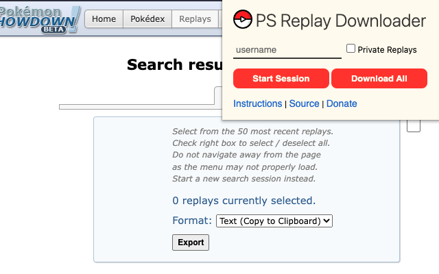

## PS Replay Downloader

PS Replay Downloader is an open-source Chrome Extension for
batch downloading [Pokémon Showdown](https://pokemonshowdown.com/) replays. Currently, it supports exporting as text (newline delimited) and CSV (file download).

Extension Download: `<PLACEHOLDER>`

Special thanks to [@cookiesamanda](https://twitter.com/cookiesamanda) for designing the logo.

### Instructions

1. Open the Chrome Extension. Enter the username and toggle whether private replays are desired. Click `Start Session` to open the PS replay search menu.
   
2. Select the replays to download by toggling the checkbox beside the replay. Toggle the checkbox beside the menu to select / deselect all.
   
   
3. Choose the export format from the dropdown menu. Click export when ready.

### FAQ

TODO

### Feature Requests

TODO
